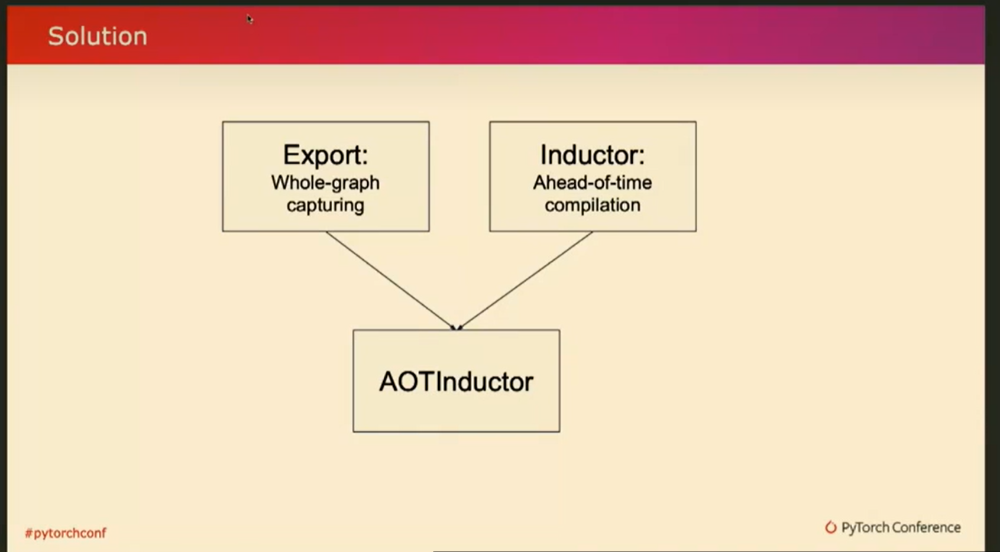
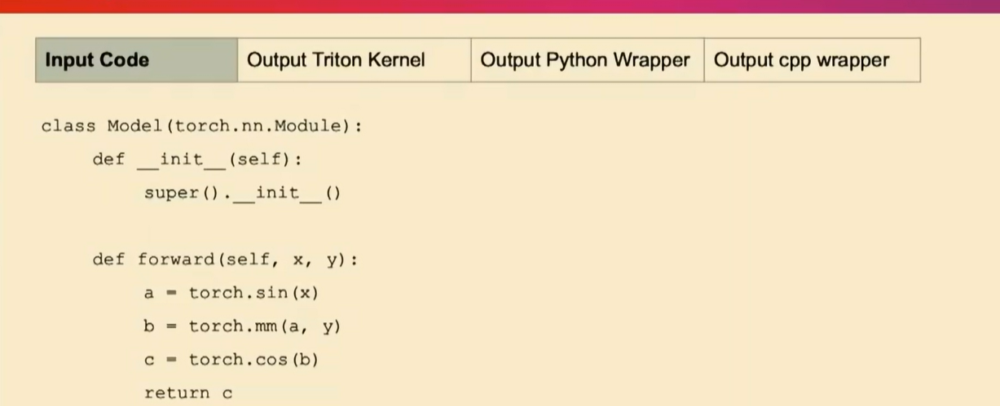
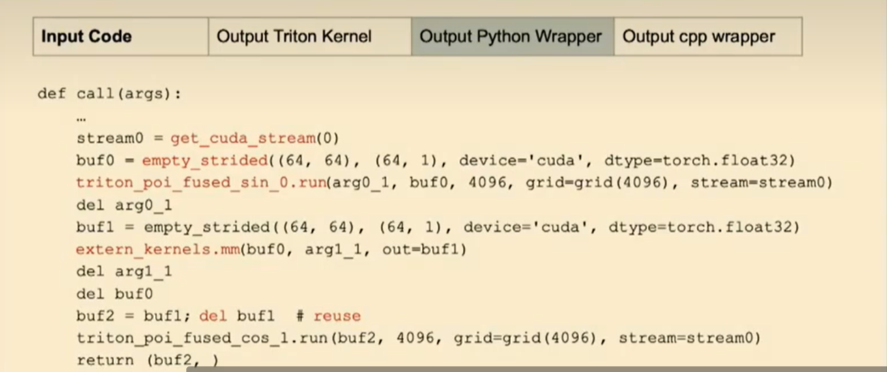
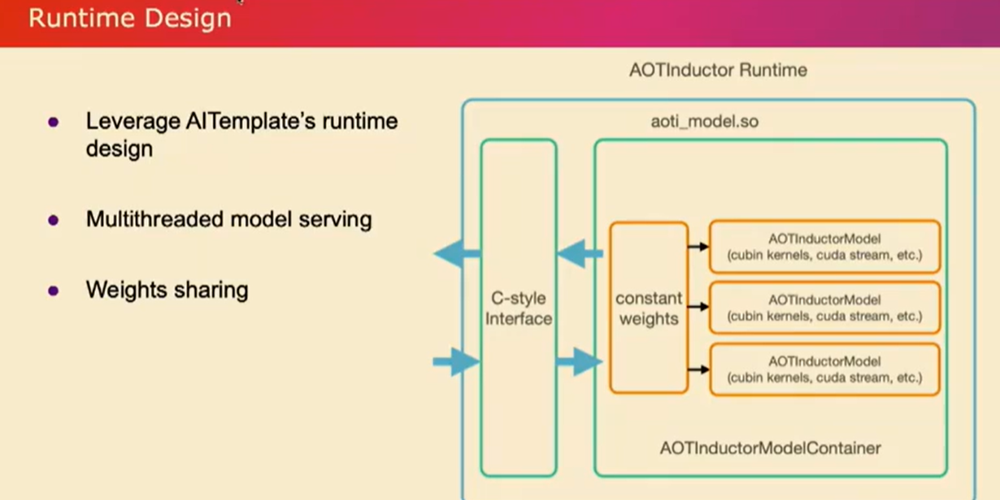
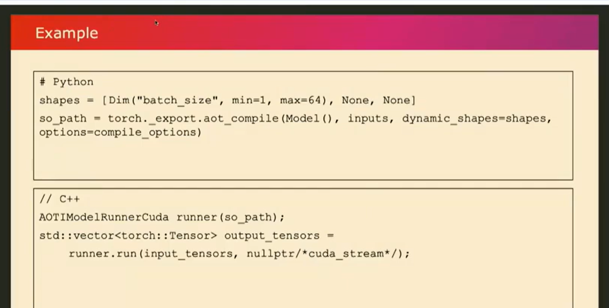
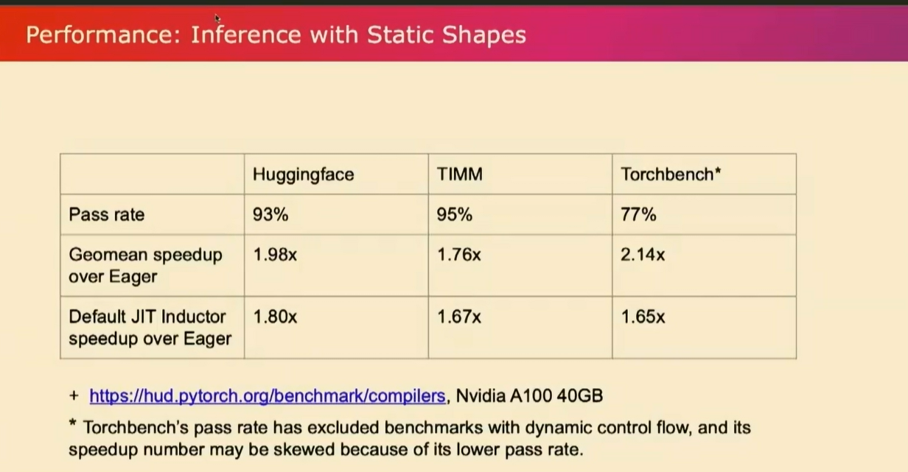

# AOTInductor: Ahead-of-Time Compilation for PT2 Exported Models - Bin Bao, Meta

## 大纲

1. 讲座背景介绍  
2. AOT Inductor的目标和意义
3. AOT Inductor技术实现方法
    - Compiler部分
    - Runtime部分  
4. AOT Inductor的性能
    - 通过率
    - 速度提升
5. AOT Inductor的使用
   - 如何编译并部署模型
6. 未来方向

## 详细要点  

### 1. 背景介绍

- Mark在前一个讲座中谈到了Python推理的难点  
- 相比训练,推理场景更加复杂多样
- 有些场景需要更可预测的运行时性能,因此可能不选择Python部署  

### 2. AOT Inductor的目标和意义

- 提供一种不使用Python的模型部署方案
- 输入是Torch导出的模型
- 编译为可部署的C++库  

### 3. 技术实现  

- Compiler部分
  - 重用JIT Compiler的Lowering和优化逻辑
  - 修改Code Generation部分:生成C++ Wrapper代码和CUDA内核
- Runtime部分  
  - 提供多线程模型服务
  - CUDA streams并发  

### 4. 性能  

- 3个基准套件上的通过率大于90%
- 与Eager模式相比,速度提升高于JIT Inductor  

### 5. 使用方法

- PyTorch导出并AOT编译模型  
- 在C++中加载编译库并执行推理  

### 6. 未来方向

- 更多的性能优化  
- 完善文档和教程

## 全文

嗨，大家好。我是Bin Bao，一名来自Meta的软件工程师。很高兴今天有机会和大家分享关于AOT Inductor的内容。

在之前的环节中，我的同事Mark试图说服大家使用Python进行推理。或许未来某一天我们能实现这个目标，但在此之前，我们需要克服一些技术难题。

实际上，相比于训练，推理阶段的情况要复杂得多。而且，我们也不能总是依赖强大的服务器和高性能GPU来运行模型推理。有时，即使你有服务器来运行推理，也可能因为想要更可预测的运行时性能而选择其他方案。因此，人们可能会基于这些原因选择其他的部署方式。

在现实生活中，我们确实可以选择使用Python或者其他方式来部署模型，而这就是我们构建AOT Inductor的原因。对于那些不希望使用Python进行推理部署的人来说，AOT Inductor可以作为一个解决方案。

如果你选择不使用Python进行推理部署，那么AOT inductor就可以作为一个解决方案。

之前Yanan也提到过，torch export是一种导出模型的方式，它表示的是整个图的形态。那么，我们就来谈谈torch inductor的特殊模式。这种特殊模式会将torch导出的图作为输入，然后将其编译成可部署的形态。

在接下来的演讲中，我将深入探讨它的技术细节，主要分为两个部分：编译器部分和运行时部分。这里我借鉴了去年torch inductor教程的一张幻灯片，作为对inductor的快速回顾。

同时，我也将强调AOT inductor需要处理的不同之处。这里的文字不必逐字阅读，但从左到右大致描述了torch inductor的不同组件的顺序。最左边的是进行输入标准化的同步操作，之后是IR lowering（中间表示层降低）并进行优化，最后则是代码生成。

所以把他想象成stack，并与默认的JIT模式进行比较，对于AOT inductor，我们需要构建哪些不同的东西？注意到输入是不同的，inductor 来自Torch export。但是，从大的方面来说，它仍然类似于我们作为jit模式接收的内容。粗略地说，对于lowering和编译器优化这些输入是不变的，我们没有理由不复用这些，它为我们提供了当前默认设置的所有性能优势。

但是，当谈到代码生成部分时，我们有两个部分。一个被称为wrapper codegen。它生成了所有外部代码 call kernel 和 allocate buffer等。目前在默认模式下，它是Python代码。我们还有后端代码生成，实际上有两个后端。一个可以生成triton代码，一个可以生成C++。如果你考虑一下AOT inductor 。因为我们要摆脱Python，所以我们不能简单地重用当前的默认代码生成，我们必须做一些不同的事情。稍后我将通过一个例子来解释这一点。

同时请记住，我们有两个后端，可以同时用于CPU和GPU。在这次演讲中，我将以GPU端为例，同样适用于CPU。因此，当我们实际改变引导器的代码生成部分时，我们要牢记这个非常重要的设计原则，即尽量重用JIT inductor。

这不仅可以免费获得所有优化，还可以减少出错的机会，容易进行验证。

接下来，我将介绍下jit inductor 会生成什么作为wrap code 和kernel code，以及aot inductor会产生不同的结果：

看这个例子：它接受forward函数的两个输入x和y，对x进行正弦操作，然后取模，然后进行余弦操作，并返回结果。在 JIT 模式下，它将生成triton代码。比如说第一个操作是正弦操作，那么它将生成类似下面的triton代码。（不要过于关注具体的逐行代码。）

在默认引导器中，它将生成triton代码，而不是C++代码或者是AOT编译代码。

对于Python部分，再次针对默认模式inductor，引导器将执行如管理CUDA流、通过(empty strided)处理临时缓冲区以及调用您刚才看到的正弦操作的Trident内核等操作。

还记得之后有一个取模操作。此外，它还会通过内存管理重复使用缓冲区等操作。所有这些操作都在Python中完成。

为了使其成为AOT预编译，我们实际上将所有这些操作改成了C++。幸运的是，我们所有这些Python操作都有某种形式的C++实现和pytoch实现支持。而AOT inductor做完后是这样的：

这些你都可以直接用C++调用以及buffer管理。

在内核部分，我们在默认模式下生成了triton代码，对吗？我们利用这一点，并进行了预编译。我们生成保存为cu bin文件。然后，我们生成了能在运行时加载这些cuda内核的代码。正如您在这里看到的高亮部分。这就是我们在编译器部分所做的。

我们只需编译所有内容，导出您的模型，并将其编译为C++。然后，我们调用C++编译器将其编译为共享库。现在让我稍微谈谈运行时部分。仅仅给你一个.so文件可能不足以满足您的实际部署需求。我们从AItemplate runtime design 中借鉴了想法，并为AOT引导器设计了这个运行时环境。它执行诸如多线程模型服务之类的操作。它具有一个线程池，可以运行刚刚编译的AOT编译模型的多个实例。然后这些模型可以共享权重。因为对于推断来说，所有权重都是常量，没有必要复制这些权重。

所有这些操作都应该共享。在GPU的情况下，我们还利用CUDA流来增加并发性。因此，当您拥有不同实例的模型时，每个实例都可以在不同的CUDA流上运行。

现在，让我们看一个例子，比如您如何实际使用它呢？因为它是预编译的，所以在Python部分，您只需调用类似torch_export.AOT_compile的函数，将其与我们的模型和示例输入一起使用，并且您还可以指定哪个维度是动态的，并传入不同的选项。

在那之后，你应该得到一个编译后的库。编译库将包含我刚才谈到的已编译模型和运行时环境。然后，假设您想在C++环境中部署模型，对吗？您可以使用我们提供的utiils类帮助我们加载so库，您只需像这里的示例一样简单地运行它，提供输入，它就会…那么性能如何呢？让我们看一些数字。

类似之前的讨论，这些数字来自我们的开源性能仪表板。这是一个推断性能指标，也是在我们一直使用的三个基准套件上进行评估的。如果您观察Hugg和Face以及Team的通过率，我们已经达到了超过90%的通过率。在Torchbench方面稍低一些，因为其模型架构的多样性。此外，值得指出的是，**当我们计算Torchbench的通过率时，我们排除了那些具有动态控制流程的基准测试，这些测试仅使用导出无法支持。**我还列出了几何平均加速比，并将默认JIT Inductor的加速比与Eager进行了比较。正如您所看到的，AOT Inductor提供了更好的性能，这主要是因为我们将Python从中删除了。再次强调，对于torch match的数字，由于通过率不是很高，所以这些数字可能有点……但总体而言，它比默认的Inductor要好。

如果您想尝试它，现在可以在Pytorch Nightly上使用它。如果您感兴趣，请尝试一下。我们还在制作教程，提供更详细的使用说明。最后但并非最不重要的是，我想借此机会感谢英特尔PyTorch团队为Torch Inductor中的CPP包装器代码生成做出的贡献，这是这个项目的关键部分。我的演讲到此结束。如果你有任何问题……是的，框架应该是通用的。可能还需要解决一些实现细节，但我认为它很有效。对于CPU也适用。我没有特别比较过它们的数字。但是，一旦您将模型导出，人们可以选择他们想要使用的任何工具。但AOT Inductor更像是PyTorch本地体验的一部分，因此它是PyTorch的一部分。好问题。所以我没有列出CUDA图模式性能与AOT Inductor的比较。所以我认为两者都很好，因为我们减少了Python的开销。
